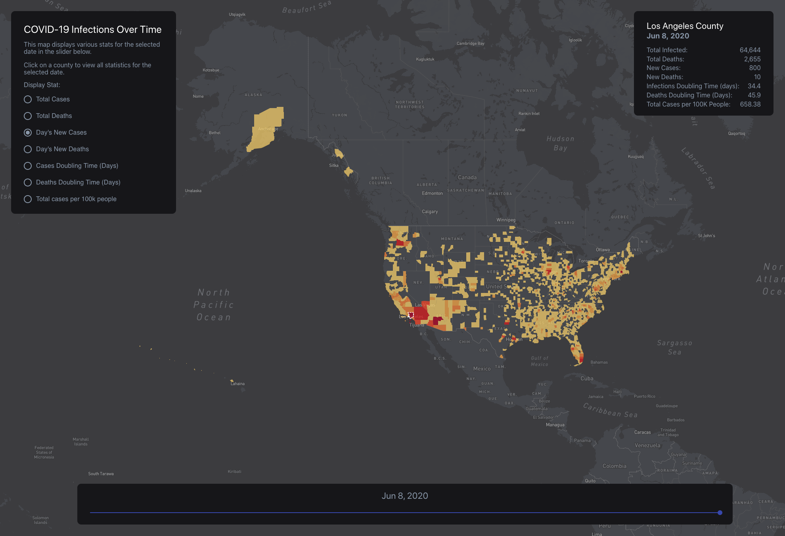

# COVID-19 Temporal Infection Map

[View map](https://5eda9b3389a6e70007d68ef7--covid-19-stat-map.netlify.app/)

This project contains a web application for the viewing of county level COVID-19 data on every day there has been an infection in the US. The app folder contains the ReactJS application while the data-constrcutor folder contains node scripts to fetch new data and run analysis on the data for the ReactJS app.

### Goal

The goal of this map is to make data available to view in a visualization that was previously unavailable. While there are many other maps displaying live data for COVID-19, there are very few who are showing data over time. This seems ridiculous, as a disease spread is very related to geography and time.

### Data Sources

- [New York Times County Level COVID-19 Dataset](https://www.kaggle.com/fireballbyedimyrnmom/us-counties-covid-19-dataset)
- US Census Population Data per County (2010)
- [US Census Bureau TIGER Shapefiles for each County](https://www.census.gov/cgi-bin/geo/shapefiles/index.php)

### Main Libraries in Use

- ReactJS
- Leaflet
- NodeJS

### Deployment

This app is hosted on GitHub and uses Netlify for continuous deplyoment. The tile layer for this map is powered by MapBox and is a custom theme I made for this map.

### Acknowledgement

Thanks to the New York Times for continuing maintaining this data set and making it avilable for everyone to use.
